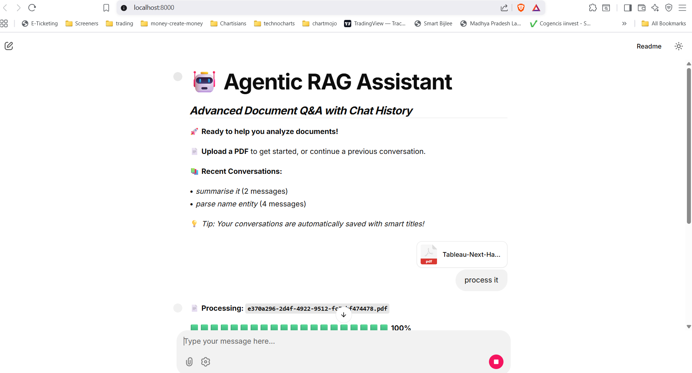

# 🤖 Agentic RAG Assistant

**Advanced Document Q&A with Chat History**

An intelligent document analysis application built with Python, LangGraph, Chainlit, ChromaDB, and Google Gemini. Features automatic conversation saving, smart chat titles, and seamless session management.

## ✨ Features

- **🧠 Intelligent Document Analysis** - Upload PDFs and ask questions about their content
- **💬 Chat History** - Automatic conversation saving with smart titles
- **🔄 Session Management** - Resume previous conversations seamlessly
- **📊 Real-time Progress** - Visual feedback during document processing
- **🎨 Modern UI** - Clean, responsive interface with custom styling
- **🛠️ Advanced Tools** - Built-in chat management utilities

## � Screenshots

### Main Interface

*Clean, modern interface with chat history and document upload capabilities*

> **Note:** To add your own screenshots, place them in the `docs/images/` directory and update the paths above.

## �🚀 Setup

1.  **Install dependencies:**
    ```bash
    pip install uv
    uv venv
    uv pip install -e .
    ```

2.  **Set up your environment:**
    Create a `.env` file in the root of the project and add your Google API key:
    ```
    GOOGLE_API_KEY=your_google_api_key
    ```

3.  **Run the application:**
    ```bash
    uv run chainlit run app.py
    ```

## 📚 Chat Management

Use the included chat management tool for advanced history operations:

```bash
# List all conversations
python chat_manager.py list --details

# Search your chat history  
python chat_manager.py search "machine learning"

# Export a conversation
python chat_manager.py export <chat_id> --format txt

# Clean up old chats
python chat_manager.py cleanup --days 30 --confirm
```

## 🏗️ Architecture

- **LangGraph**: Orchestrates the RAG workflow with state management
- **Chainlit**: Provides the interactive web interface
- **ChromaDB**: Vector database for document storage and retrieval
- **HuggingFace Embeddings**: Sentence transformers for text embedding
- **Google Gemini**: Large language model for response generation

## 📁 Project Structure

```
agentic-rag-app/
├── src/
│   ├── agent.py          # LangGraph RAG agent
│   └── vector_store.py   # ChromaDB interface
├── app.py                # Chainlit application
├── ingest.py             # Document ingestion utility
├── chat_manager.py       # Chat history management tool
├── chat_history/         # Saved conversations (auto-created)
├── public/               # Custom CSS and assets
└── .chainlit/            # Chainlit configuration
```
uv run chainlit run app.py -w
```

## 🤝 Contributing

### Adding Screenshots

Help improve the documentation by adding screenshots:

1. **Run the application** and navigate to key features
2. **Take high-quality screenshots** (1200-1600px wide)
3. **Save as PNG files** in the `docs/images/` directory
4. **Update README.md** with proper image references
5. **Follow naming convention**: Use kebab-case (e.g., `main-interface.png`)

See `docs/images/README.md` for detailed screenshot guidelines.

### Development

1. Fork the repository
2. Create a feature branch (`git checkout -b feature/amazing-feature`)
3. Commit your changes (`git commit -m 'Add amazing feature'`)
4. Push to the branch (`git push origin feature/amazing-feature`)
5. Open a Pull Request

## 📄 License

This project is open source and available under the [MIT License](LICENSE).

## 🙏 Acknowledgments

- **LangChain** - For the powerful RAG framework
- **Chainlit** - For the beautiful chat interface
- **ChromaDB** - For efficient vector storage
- **Hugging Face** - For the embedding models
- **Google** - For the Gemini language model

---

*Built with ❤️ for the AI community*